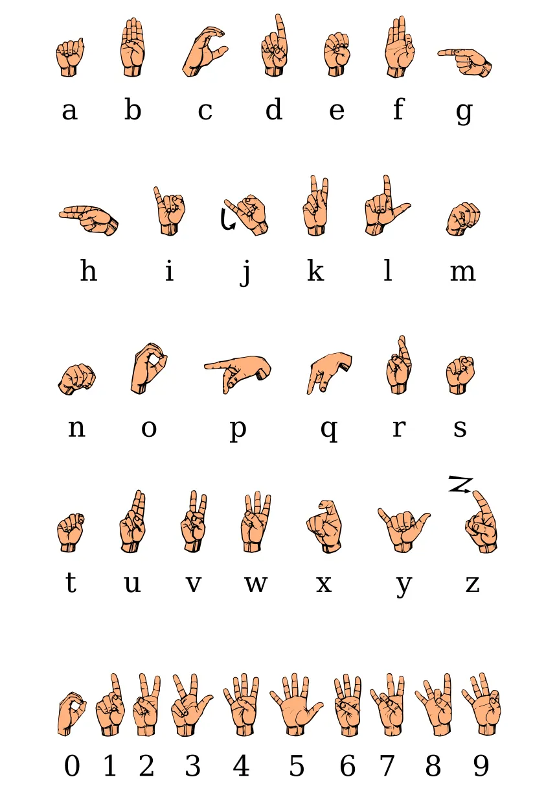

# 🤖 Hand Gesture Recognition using MediaPipe & LSTM

This project enables real-time recognition of hand gestures (A-Z, 0-9) using OpenCV, MediaPipe, and a trained LSTM model in TensorFlow/Keras. It provides tools to collect data, train the model, and recognize gestures live from a webcam feed.

---

## 📸 Overview

- **Capture** hand gesture data (A-Z, 0-9)
- **Process** data using MediaPipe for hand keypoint extraction
- **Train** an LSTM-based deep learning model
- **Predict** gestures in real time with OpenCV visualization

---

## 🚀 Quick Start

> ⚠️ **Recommended Environment**: Use **Anaconda** with Python **3.12** (due to compatibility issues with newer versions of some libraries). Tested with:
>
> - Conda version: `conda 24.11.3`


```cmd
for %i in (A B C D E F G H I J K L M N O P Q R S T U V W X Y Z 0 1 2 3 4 5 6 7 8 9) do mkdir %i

```

If you wanna use this particular code then follow the particular steps

1. You can go for anaconda or python , but most preferable is anaconda (Jupyter Notebook)    
2. Create a folder names as Images with subfolders of all alphabets and digits
3. copy collectdata.py and run it to save your images into a file named as Images 
4. Capture a few images and save them
5. copy and run function.py to run all the necessary functions which will create points on hand to track them 
6. copy and run data.py to save the end points of your hand and save thema as npy format for each alphabet
7. Copy and run trainmodel.py to run the model and train your model
8. If you want you can change the epoch size in a range of 200 and 500
9. A new file will be automatically saved model.h5 where your model will be saved
10. If your accuracy is greater than 0.8 then go ahead
11. Copy and run app.py to run the final code as required
    
Requirements 
1. tensorflow==2.15.0
2. mediapipe==0.10.9
3. opencv-python==4.9.0.80
4. scikit-learn==1.4.2
5. numpy

   Check the ASl
   
 
